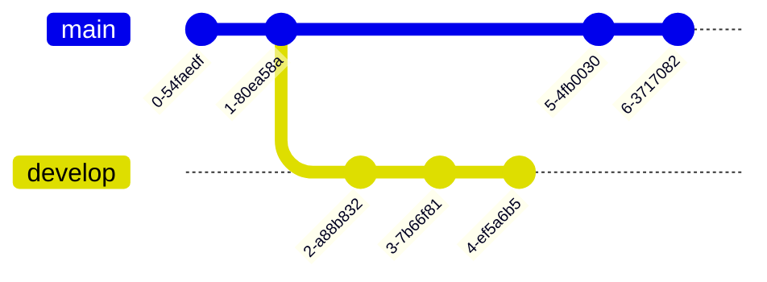
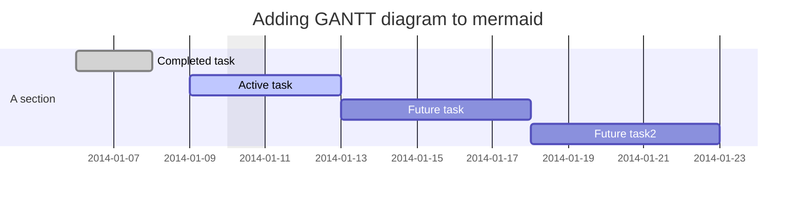

```stl
solid cube-ascii
    facet normal  0.000000e+00  0.000000e+00  1.000000e+00
        outer loop
            vertex  0.000000e+00  0.000000e+00  1.000000e+01
            vertex  1.000000e+01  0.000000e+00  1.000000e+01
            vertex  0.000000e+00  1.000000e+01  1.000000e+01
        endloop
    endfacet
    facet normal  0.000000e+00  0.000000e+00  1.000000e+00
        outer loop
            vertex  1.000000e+01  1.000000e+01  1.000000e+01
            vertex  0.000000e+00  1.000000e+01  1.000000e+01
            vertex  1.000000e+01  0.000000e+00  1.000000e+01
        endloop
    endfacet
    facet normal  1.000000e+00  0.000000e+00  0.000000e+00
        outer loop
            vertex  1.000000e+01  0.000000e+00  1.000000e+01
            vertex  1.000000e+01  0.000000e+00  0.000000e+00
            vertex  1.000000e+01  1.000000e+01  1.000000e+01
        endloop
    endfacet
    facet normal  1.000000e+00  0.000000e+00  0.000000e+00
        outer loop
            vertex  1.000000e+01  1.000000e+01  0.000000e+00
            vertex  1.000000e+01  1.000000e+01  1.000000e+01
            vertex  1.000000e+01  0.000000e+00  0.000000e+00
        endloop
    endfacet
    facet normal  0.000000e+00  0.000000e+00 -1.000000e+00
        outer loop
            vertex  1.000000e+01  0.000000e+00  0.000000e+00
            vertex  0.000000e+00  0.000000e+00  0.000000e+00
            vertex  1.000000e+01  1.000000e+01  0.000000e+00
        endloop
    endfacet
    facet normal  0.000000e+00  0.000000e+00 -1.000000e+00
        outer loop
            vertex  0.000000e+00  1.000000e+01  0.000000e+00
            vertex  1.000000e+01  1.000000e+01  0.000000e+00
            vertex  0.000000e+00  0.000000e+00  0.000000e+00
        endloop
    endfacet
    facet normal -1.000000e+00  0.000000e+00  0.000000e+00
        outer loop
            vertex  0.000000e+00  0.000000e+00  0.000000e+00
            vertex  0.000000e+00  0.000000e+00  1.000000e+01
            vertex  0.000000e+00  1.000000e+01  0.000000e+00
        endloop
    endfacet
    facet normal -1.000000e+00  0.000000e+00  0.000000e+00
        outer loop
            vertex  0.000000e+00  1.000000e+01  1.000000e+01
            vertex  0.000000e+00  1.000000e+01  0.000000e+00
            vertex  0.000000e+00  0.000000e+00  1.000000e+01
        endloop
    endfacet
    facet normal  0.000000e+00  1.000000e+00  0.000000e+00
        outer loop
            vertex  0.000000e+00  1.000000e+01  1.000000e+01
            vertex  1.000000e+01  1.000000e+01  1.000000e+01
            vertex  0.000000e+00  1.000000e+01  0.000000e+00
        endloop
    endfacet
    facet normal  0.000000e+00  1.000000e+00  0.000000e+00
        outer loop
            vertex  1.000000e+01  1.000000e+01  0.000000e+00
            vertex  0.000000e+00  1.000000e+01  0.000000e+00
            vertex  1.000000e+01  1.000000e+01  1.000000e+01
        endloop
    endfacet
    facet normal  0.000000e+00 -1.000000e+00  0.000000e+00
        outer loop
            vertex  1.000000e+01  0.000000e+00  1.000000e+01
            vertex  0.000000e+00  0.000000e+00  1.000000e+01
            vertex  1.000000e+01  0.000000e+00  0.000000e+00
        endloop
    endfacet
    facet normal  0.000000e+00 -1.000000e+00  0.000000e+00
        outer loop
            vertex  0.000000e+00  0.000000e+00  0.000000e+00
            vertex  1.000000e+01  0.000000e+00  0.000000e+00
            vertex  0.000000e+00  0.000000e+00  1.000000e+01
        endloop
    endfacet
endsolid
```
